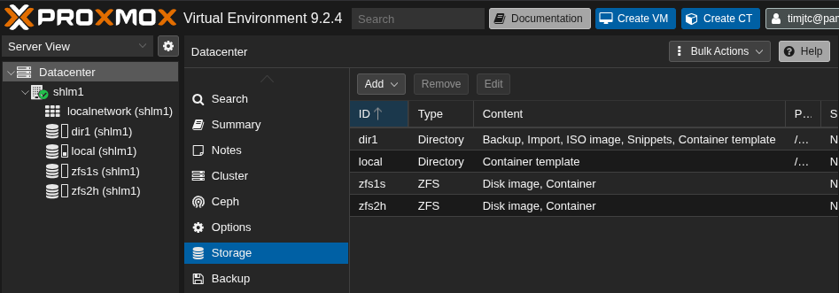
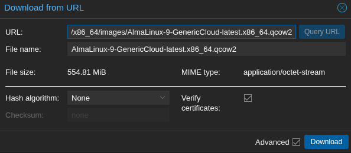
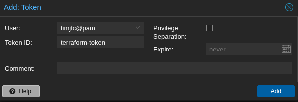
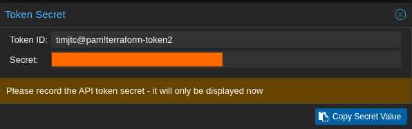
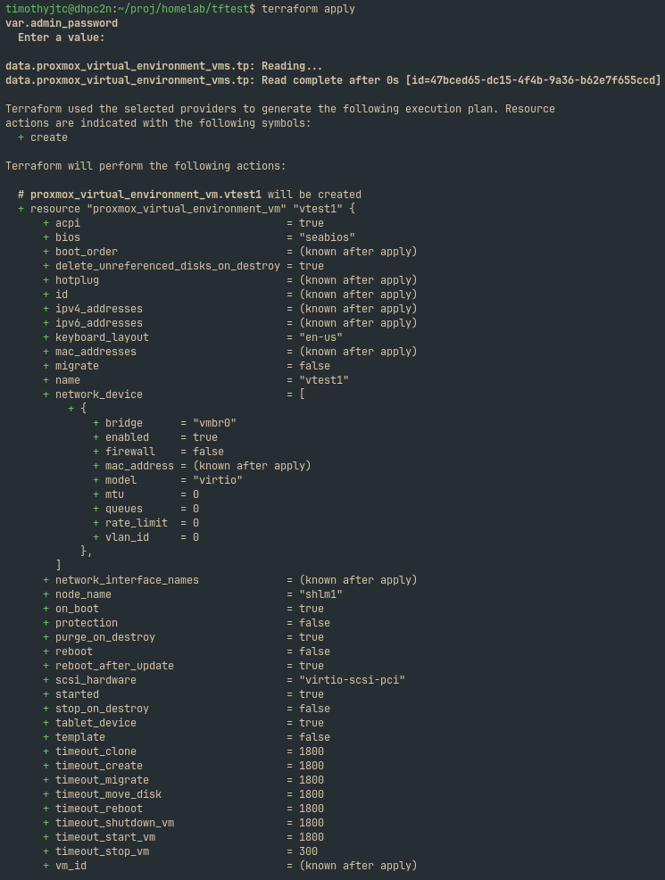
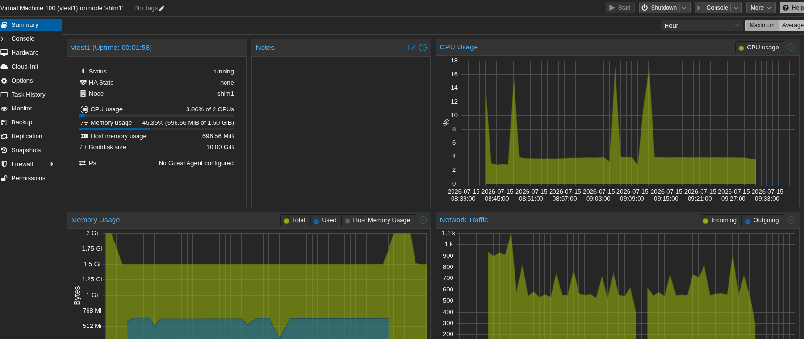
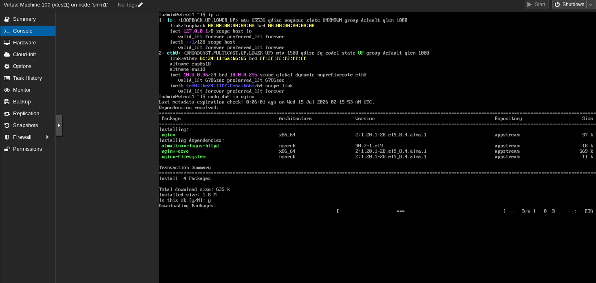
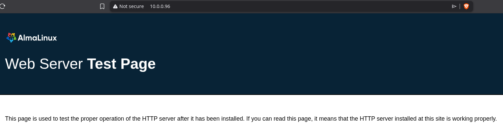
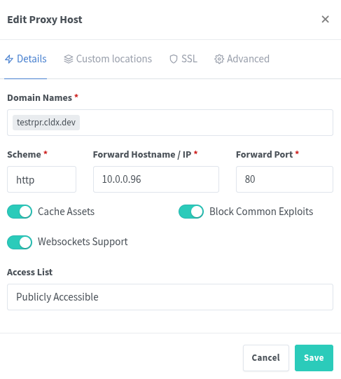

---
aliases:
  - Scalable Homelab Rebuild
tags:
  - project/scalable-homelab-rebuild
created: 2026-07-11T17:30
up: "[[personal.kanban|Personal projects]]"
---
# Problem

My current homelab setup uses a monolithic OS (Ubuntu Server) with containerized applications installed. Recent security vulnerabilities prompted a need for a SOC homelab, as well as other profitable project ideas that needs deployment on scalable compute resources.

# Definitions

## Objectives

- Rebuild my current homelab setup from monolithic OS to a hypervisor-based setup.
- Support future projects and services that can be hosted on-prem.
- Produce a setup that is easily reproducible and declarative in nature.
- Demonstrate skills for career portfolio.

## Scope & Schedule

- Focus on creating a minimal setup fit for a home local network.
- Must be finished in less than a week or so (11 July 2026 - 15 July 2026).

## Task Management

The framework/tool that will be used to manage tasks: **Kanban boards**, **Kanban Plugin in Obsidian**.

left:: "[[scalable-homelab-rebuild.kanban]]"

## Knowledge Management

No knowledge management tools will be used for this project. All documentations are expected to be written in this document.

The following rules on documentation writing applies:
- All **imperative actions** that only needs to be executed once and cannot be scripted (i.e. has an interactive component) remains in this documentation **only**.
- All **imperative actions** that can be automated by scripting can be documented here or in a version control repository.
- All **declarative state** can be documented here or in a version control repository.

# Resources

Available compute asset(s):
- shlm1 - Homelab server
- vmi2635135 - VPS with public IP

# Implementation

## Solutions and infrastructure design

First, the appropriate tools, software, technologies and infrastructure design must be decided upon based on the following criteria:
- Must be open-source software, or at least has license for free use and accessibility (e.g. MIT, GPL, freeware, etc.)
- Supports the Project Objectives in terms of declarative, reproducible, and flexible configuration.
- Strikes a balance between enterprise and personal home setting in terms of setup complexity and resources needed.

As such, the table below lists the tool decided upon for each layer:

| Layer             | Decision                                                                                             |
| ----------------- | ---------------------------------------------------------------------------------------------------- |
| Config management | [Ansible](https://docs.ansible.com/)                                                                 |
| OS                | [AlmaLinux](https://almalinux.org/) (VMs), [Debian](https://www.debian.org/) (Proxmox-VE hypervisor) |
| IaC               | [Terraform](https://developer.hashicorp.com/terraform) (via bpg/proxmox or telmate/proxmox)          |
| Hypervisor        | [Proxmox-VE](https://pve.proxmox.com/wiki/Main_Page)                                                 |

Figure:
-

## Hardware setup

**Proxmox VE 9.2-1 (PVE)** is installed on the server machine with the following configuration:
```
Hostname: shlm1
Cores: 4
RAM: 11.56G
Storage:
- 59.6G SSD (16G root, 4G swap)
- 465.8G HDD (planned for additional storage - images, backups, low-priority VMs, etc.)
```

The **Proxmox VE Post Install** script (managed by the community) is used for configuring PVE for non-subscription use.
```
bash -c "$(curl -fsSL https://raw.githubusercontent.com/community-scripts/ProxmoxVE/main/tools/pve/post-pve-install.sh)"
```

Install misc packages.
```
apt install sudo parted vim
```

Storage partitions are configured as follows:
```
1x block LVM (root, already existing after installation)
2x block ZFS pool (1x on SSD for high priority VMs, 1x on HDD for others)
1x directory storage (for images, templates, snippets, backups, etc.)
```

Sculpting the storage partitions the way it is needed was hard, and multiple re-installs were made. The limited SSD storage prompts for the need to further reduce the LV group, fitting a 16GB root partition and 4GB swap, plus other EFI/boot partitions, just to give way for a remaining 37GB of fast VM storage meant to be formatted as a ZFS block.

The Proxmox installer does not offer a way to directly do this, so the only option is to expand the LV after installation. The final re-install had the following storage configuration:
```
hdsize = 21GB
swapsize = 4GB
maxroot = 16GB
maxvz = 0
minfree = 0
```

The resulting root partition is only 8.25G, with the remaining 8.25G unallocated. This was due to the PVE's installer computation of storage. The LV was extended by:
```bash
lvextend -l +100%FREE /dev/pve/root
resize2fs /dev/pve/root
parted /dev/sda unit MiB print  # confirm where the installer's partitions end
parted /dev/sda unit MiB mkpart primary <end_of_last_partition> 100%
partprobe
lsblk  # confirm if changes are correct
```

The content types for each storage resource was configured as follows:
- local (Directory from pve LVM)
	- Container template `vztmpl`
- dir1 (Directory)
	- `iso`, `backup`, `vztmpl`, `snippets`, `import`
- zfs1s (ZFS pool, SSD)
	- `image`, `containers`
- zfs2h (ZFS pool, HDD)
	- `image`, `containers`

Figure: Proxmox storage configuration in Web GUI

 ^cc3137

Other post-installation tasks were also performed:
- Non-root PVE realm user created for personal access to PVE Web GUI, enforcing principle of least privilege when it comes to permissions.
- 2FA for PVE Web GUI logins is also added to root and non-root user(s).

## Hardening PVE host machine

### Non-root user accounts

A non-root PAM admin account is created for personal access to SSH and PVE Web GUI. If needed, future user accounts can be created within PVE realm only, enforcing principle of least privilege when it comes to permissions.

### Setting up Two-factor Authentication for all PAM sessions and PVE realm logins

Two-Factor Authentication (2FA) for SSH and TTY on Linux is also enabled by installing `libpam-google-authenticator`:
```bash
apt install libpam-google-authenticator
```

Both `/etc/pam.d/sshd` and `/etc/pam.d/login` are modified to add the following at the top:
```
auth required pam_google_authenticator.so nullok
```

Modified `/etc/ssh/sshd_config` and set the following values:
```
# For older versions, it might be ChallengeResponseAuthentication
KbdInteractiveAuthentication yes
UsePAM yes
```

Restarted SSH service.
```bash
systemctl restart ssh
```

Each user must now enroll their own 2FA authenticator by running `google-authenticator`, prompting the user with options. The following are the preferred selection:
- Time-based tokens: Yes
- Disallow multiple uses: Yes
- Rate-limiting: Yes

Optionally, the same secret key given by `google-authenticator` can be used in setting up 2FA for PVE realm user accounts in the web GUI to unify TOTP codes for both SSH/TTY and PVE Web GUI logins.

### Probing listening ports and services

Verified which services are active and which ones are exposed:
```bash
systemctl list-units --type=service --state=running
ss -tulpn
```

There are a few that needs action (or future action):
- `rpcbind` and `nfs-blkmap` on UDP/TCP 111
	- Unsure if it will be used in the future, will be hardened on the network/VPN side.
- `spiceproxy` on TCP 3128
	- Unused, disabled with `systemctl disable --now spiceproxy.service`
- `pveproxy` on TCP 8006
	- Will be hardened on the network/VPN side

### Sysctl network hardening

The following is written to `/etc/sysctl.d/99-hardening.conf`:
```
net.ipv4.conf.all.rp_filter = 2
net.ipv4.conf.default.rp_filter = 2
net.ipv4.icmp_echo_ignore_broadcasts = 1
net.ipv4.conf.all.accept_redirects = 0
net.ipv4.conf.default.accept_redirects = 0
net.ipv4.conf.all.send_redirects = 0
net.ipv4.conf.default.send_redirects = 0
net.ipv4.tcp_syncookies = 1
net.ipv4.ip_forward = 1
net.ipv6.conf.all.forwarding = 1
```

- `rp_filter = 2` enables reverse path filtering, it prevents IP source address spoofing. A value of `2` (loose mode) is more compatible with VPN (planning to install Tailscale).
- `icmp_echo_ignore_broadcasts = 1` ignores ICMP echo requests sent to broadcast addresses. This protects from smurf attacks.
- `accept_redirects = 0` ignores ICMP redirect messages. This prevents from MITM and traffic hijacking attacks. `send_redirects = 0` also disables the PVE host itself from sending ICMP redirects.
- `tcp_syncookies = 1` enables SYN cookies, which protects from TCP SYN flood attacks.
- `net.ipv4.ip_forward = 1` and `net.ipv6.conf.all.forwarding = 1` is enabled for routing through VPN (plan to install Tailscale).
- Each IPv4 config has `all` and `default` lines, so **all current** and **future** interfaces are affected. For the sole IPv6 forwarding setting, it does not need that since it is a global flag (refer to [[#^92a919]], [[#^7a4643]]).

Once all settings are confirmed, `sudo sysctl --system` is executed to apply these settings.

### Defense-in-depth against brute-forcing

Even with 2FA enabled, `fail2ban` will be installed as another layer against brute-forcing:
```bash
apt install fail2ban
```

The following is written in `/etc/fail2ban/jail.d/1-proxmox.conf`:
```
[proxmox]
enabled = true
port = https,http,8006
filter = proxmox
backend = systemd
maxretry = 3
findtime = 5m
bantime = 1h
```

To filter for failed authentication, `/etc/fail2ban/filter.d/proxmox.conf` is created with the following content:
```
[Definition]
failregex = pvedaemon\[.*authentication failure; rhost=<HOST> user=.* msg=.*
ignoreregex =
journalmatch = _SYSTEMD_UNIT=pvedaemon.service
```

The fail2ban service is restarted to apply the changes:
```bash
systemctl restart fail2ban
```

Verify the fail2ban jail is active:
```bash
fail2ban-client status proxmox
```

### Tailscale network overhaul

Before connecting the PVE host to Tailscale as planned, several quality-of-life and security changes are made to the Tailscale tailnet under personal account:
- Expired and stale devices are removed.
- The tag system were restructured.
- Appropriate access controls are assigned to the restructured tags. 

These steps will be documented in a separate document as they may be subject to change. Refer to [tailnet-overhaul](tailnet-overhaul.md).

After all changes are confirmed in the Tailscale dashboard and the tailnet policy JSON file, the PVE host is then registered to the tailnet:
```bash
sudo tailscale up --advertise-tags=tag:server-pve,tag:server-rpr--allow --advertise-routes=10.0.0.0/24 --accept-routes
# The server-pve tag indicates it is a PVE server, the server-rpr--allow tag allows it to communicate with public-facing reverse proxies.
# The --advertise-routes and --accept-routes allows Tailscale to handle routing between VMs and public-facing VPS
```

Running the commands above might make Tailscale issue a warning:
```
Warning: UDP GRO forwarding is suboptimally configured on vmbr0, UDP forwarding throughput capability will increase with a configuration change.
See https://tailscale.com/s/ethtool-config-udp-gro
```

To resolve this (refer to [[#^f2c2da]]), the following are executed:
```bash
NETDEV=$(ip -o route get 8.8.8.8 | cut -f 5 -d " ")
sudo ethtool -K $NETDEV rx-udp-gro-forwarding on rx-gro-list off
cat << 'EOF' | sudo tee /etc/systemd/system/tailscale-gro.service
[Unit]
Description=Enable UDP GRO forwarding for Tailscale
After=network-online.target
Wants=network-online.target

[Service]
Type=oneshot
ExecStart=/usr/sbin/ethtool -K vmbr0 rx-udp-gro-forwarding on rx-gro-list off
RemainAfterExit=yes

[Install]
WantedBy=multi-user.target
EOF
sudo systemctl daemon-reload
sudo systemctl enable --now tailscale-gro.service
```

## Creating first VM template

After all hardening steps are complete, the next task is to create an initial VM and test the network configuration. First, an AlmaLinux 9.8 generic cloud image is downloaded:
```bash
cd /mnt/pve/dir1/import
wget https://repo.almalinux.org/almalinux/9/cloud/x86_64/images/AlmaLinux-9-GenericCloud-latest.x86_64.qcow2

```

Figure: Downloading directly from PVE Web GUI



Then the first VM is created:
```bash
qm create 9001 --name almalinux-9-genericcloud-tp --memory 2048 --cores 2 --net0 virtio,bridge=vmbr0
qm importdisk 9001 /mnt/pve/dir1/import/AlmaLinux-9-GenericCloud-latest.x86_64.qcow2 lvm1h
```

Note: The `importdisk` command specifies `lvm1h` as the storage resource where the VM is to be created.

A cloud-init image is created, then the first AlmaLinux VM is converted into a template:
```bash
qm set 9001 --scsihw virtio-scsi-pci --scsi0 lvm1h:vm-9001-disk-0
qm set 9001 --ide2 lvm1h:cloudinit
qm set 9001 --boot order=scsi0
qm set 9001 --serial0 socket --vga serial0
qm template 9001
```

By default, cloud images do not allow SSH passphrase login. To enable it for the time-being, SSH keys are cleared (if there is any), then a snippet is created:
```bash
qm set 9001 --delete sshkeys
cat > /mnt/pve/dir1/snippets/enable-password-auth.yaml << 'EOF'
#cloud-config
ssh_pwauth: true
runcmd:
  - |
    TARGET_USER=$(awk -F: '$3>=1000 && $3<60000 {print $1}' /etc/passwd | head -1)
    usermod -aG wheel "$TARGET_USER"
    echo "$TARGET_USER ALL=(ALL) NOPASSWD:ALL" > /etc/sudoers.d/99-terraform-user
    passwd -u "$TARGET_USER"
  - sed -i 's/^#\?PasswordAuthentication.*/PasswordAuthentication yes/' /etc/ssh/sshd_config
  - systemctl restart sshd
EOF
```

This snippet is added to the first VM:
```bash
qm set 9001 --cicustom "vendor=dir1:snippets/enable-password-auth.yaml"
```

## Enabling Terraform integration

### Separate user account

First, add the `TerrformProv` role
```bash
pveum role add TerraformProv -privs "VM.Allocate VM.Clone VM.Config.CDROM VM.Config.CPU VM.Config.Cloudinit VM.Config.Disk VM.Config.HWType VM.Config.Memory VM.Config.Network VM.Config.Options VM.Console VM.Audit VM.PowerMgmt Datastore.AllocateSpace Datastore.Audit Pool.Allocate SDN.Use"
```

Create a new PVE user for Terraform:
```bash
pveum user add terraform@pve
```

Assign the new `terraform` user to `TerraformProv` role:
```bash
pveum aclmod / -user terraform@pve -role TerraformProv
```

Add an API token:
```bash
pveum user token add terraform@pve terraform-token --privsep=0
```

### Use existing non-root user account (better for multi-tenant)

Since there is an existing non-root user account, it can also be used to create an API token for Terraform:
```bash
pveum user token add timjtc@pam terraform-token --privsep=0
```

Figure: Adding API tokens through PVE Web GUI




## Provisioning and production test

A simple `main.tf` Terraform configuration is created:
```hcl
terraform {
  required_providers {
    proxmox = {
      source  = "bpg/proxmox"
      version = "~> 0.111.1"
    }
  }
}

provider "proxmox" {
  endpoint  = "https://10.0.0.25:8006/"
  api_token = var.proxmox_api_token
  insecure  = true

  ssh {
    agent    = true
    username = "timjtc"
  }
}

variable "admin_password" {
  type      = string
  sensitive = true
}

variable "proxmox_api_token" {
  type      = string
  sensitive = true
}

data "proxmox_virtual_environment_vms" "tp" {
  filter {
    name   = "name"
    values = ["almalinux-9-genericcloud-tp"]
  }
}

resource "proxmox_virtual_environment_vm" "vtest1" {
  name      = "vtest1"
  node_name = "shlm1"

  clone {
    vm_id = data.proxmox_virtual_environment_vms.tp.vms[0].vm_id
  }

  cpu {
    type = "host"
    cores = 2
  }

  memory {
    dedicated = 1536    # MB
  }

  disk {
    datastore_id = "zfs1s"
    interface    = "scsi0"
    size         = 10   # GB
  }

  network_device {
    bridge = "vmbr0"
  }

  initialization {
    datastore_id = "lvm1h"
    user_account {
      username = "admin"
      password = var.admin_password
    }
    ip_config {
      ipv4 {
        address = "dhcp"
      }
    }
  }
}

output "vm_ip" {
  value = proxmox_virtual_environment_vm.vtest1.ipv4_addresses
}
```

A `.secrets.auto.tfvars` is also created containing the PVE API secret key generated earlier:
```
proxmox_api_token = "timjtc@pam!terraform-token=<SECRET_KEY_HERE>"
```

Terraform state is initialized and applied:
```bash
terraform init
terraform apply
```

Figure: `terraform apply` and the resulting VM visible in Proxmox Web GUI





Now to test public-facing connections, a simple Nginx web server is installed in the VM and then enabled:
```bash
sudo dnf install nginx -y
sudo systemctl enable nginx
sudo systemctl start nginx
```

Figure: Web server up and running in vtest1 (10.0.0.96)



Figure(s): A temporary DNS A record is created for testing and registered in Nginx Proxy Manager to point towards the local IP of the VM (which was advertised on the PVE host running Tailscale)




Figure: Local VM running Nginx is successfully reached via test domain name


Note: A painful troubleshooting effort was made in figuring out why the PVE host does not route properly at first (refer to [[#Changes - 2026-07-15 17 16]]).

# Review

What can be improved:
- [ ] Ansible playbooks for automating host configuration after hardware setup.

# Change Log - 2026-07-15 17:16

The public-facing VPS cannot ping the local VM at first, even with the Tailscale routes advertised at the PVE host. To solve this;

The public-facing VPS is first allowed to accept advertised routes:
```bash
sudo tailscale set --accept-routes
```

A grant rule is specified in the Tailscale policy file to specifically allow connections from the VPS subnet to local advertised subnet, and vice versa:
```json
		{
			"src": ["tag:server-rpr", "<PUBLIC_VPS_CIDR>", "10.0.0.0/24"],
			"dst": ["10.0.0.0/24", "<PUBLIC_VPS_CIDR>"],
			"ip":  ["*:*"],
		},
```

Note: The grant rule shown above is temporary, the use of [IP Sets in Tailscale](https://tailscale.com/docs/features/tailnet-policy-file/ip-sets) should be much cleaner.

# Change Log - 2026-07-14 18:37

Problems are encountered when provisioning VMs on zfs2h via Terraform, citing a hardware failure when cloning the template from zfs2h to zfs1s. Due to this, zfs2h is recreated into an LVM block named lvm1h.

# References

- https://community-scripts.org/scripts/post-pve-install?id=post-pve-install
- https://ubuntu.com/tutorials/configure-ssh-2fa
- https://pve.proxmox.com/wiki/Installation#advanced_lvm_options
- https://docs.kernel.org/networking/ip-sysctl.html ^92a919
- https://lkml.org/lkml/2025/7/1/1170 ^7a4643
- https://pve.proxmox.com/wiki/Fail2ban
- https://registry.terraform.io/providers/bpg/proxmox/latest/docs
- https://tailscale.com/s/ethtool-config-udp-gro ^f2c2da
- https://tailscale.com/docs/features/tailnet-policy-file/ip-sets