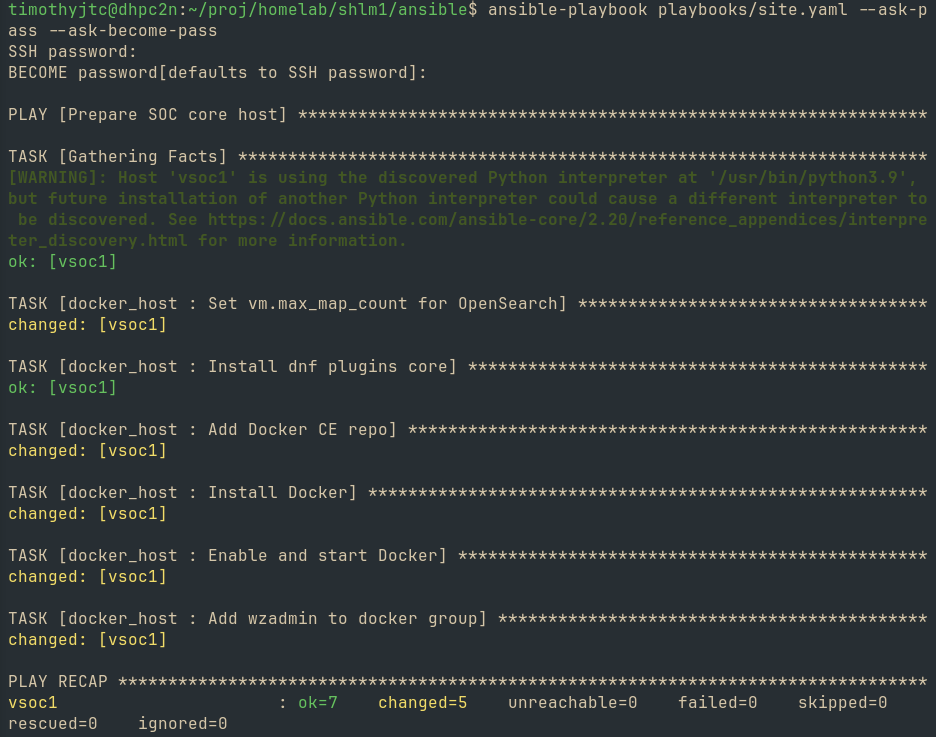
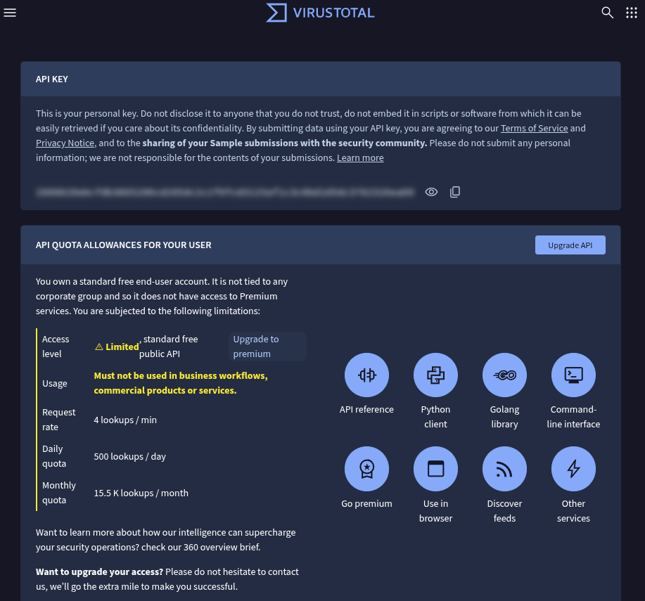
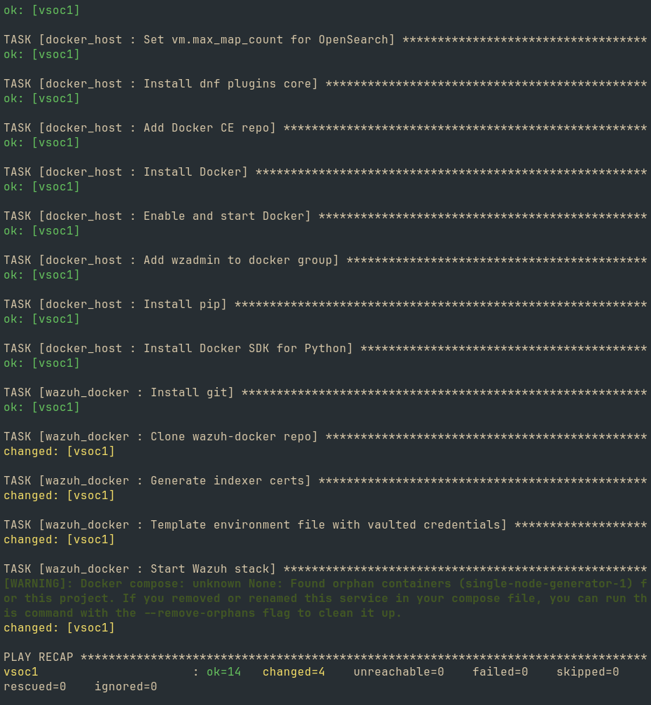
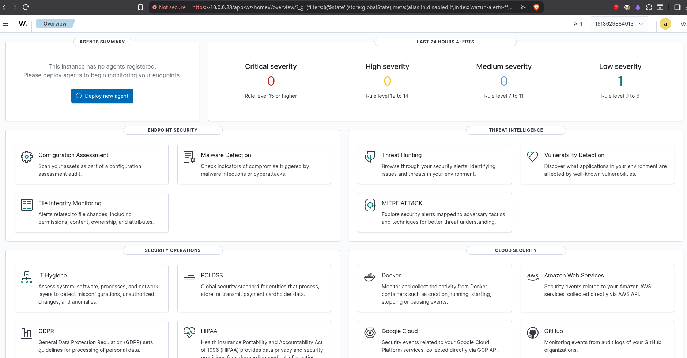
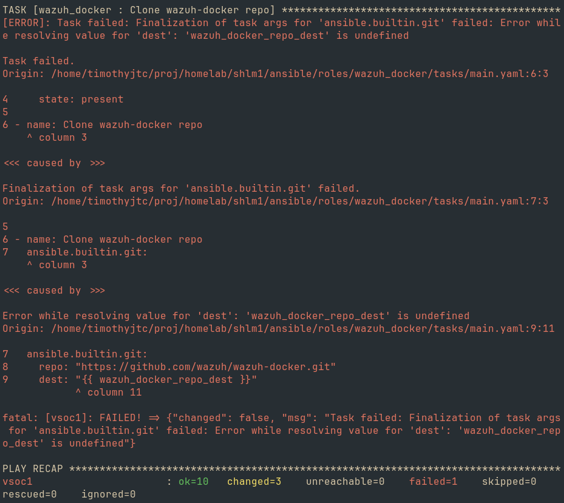

---
aliases:
  - "SecOps Homelab"
tags:
  - project/sec-ops-homelab
created: "2026-07-13T17:24"
---
# Problem

Recent malware intrusions (14-20 June 2026) have compromised some of my personal accounts. The attack falls under [T1185](https://attack.mitre.org/techniques/T1185/) and [T1528](https://attack.mitre.org/techniques/T1528/) in the MITRE ATT&CK Framework.

# Definitions

## Objectives

- Build a SOC laboratory in a homelab setup that can detect and prevent malicious activity.
- Produce a setup that is easily reproducible and declarative in nature.
- Demonstrate skills for career portfolio.

## Scope & Schedule

- Focus on creating a minimal setup fit for a home local network.
- Must be finished within a week or so (15 July 2026 - 22 July 2026).

## Task Management

The framework/tool that will be used to manage tasks: **Kanban boards**, **Kanban Plugin in Obsidian**.

left:: "[[sec-ops-homelab.kanban|SecOps Homelab Kanban]]"

## Knowledge Management

No knowledge management tools will be used for this project. All documentations are expected to be written in this document.

# Resources

Available compute asset(s):
- shlm1 - Homelab server

# Implementation

## Solutions and infrastructure design

First, the appropriate tools, software, technologies and infrastructure design must be decided upon based on the following criteria:
- Must be open-source software, or at least has license for free use and accessibility (e.g. MIT, GPL, freeware, etc.)
- Supports the Project Objectives in terms of declarative, reproducible, and flexible configuration.
- Strikes a balance between enterprise and personal home setting in terms of setup complexity and resources needed.

As such, the table below lists the tool decided upon for each layer:

| Layer                    | Decision                                                                                                                                                                              |
| ------------------------ | ------------------------------------------------------------------------------------------------------------------------------------------------------------------------------------- |
| Visualization            | Wazuh dashboard + [ELK](https://www.elastic.co/elastic-stack) stack via [Filebeat](https://www.elastic.co/beats/filebeat) (if resources permit)                                       |
| Automations/Integrations | [Shuffle SOAR](https://shuffler.io/), [Wazuh-VirusTotal integration](https://documentation.wazuh.com/current/user-manual/capabilities/malware-detection/virus-total-integration.html) |
| IDS                      | [Suricata](https://suricata.io/)                                                                                                                                                      |
| SIEM/XDR                 | [Wazuh](https://wazuh.com/)                                                                                                                                                           |
| Config management        | [Ansible](https://docs.ansible.com/)                                                                                                                                                  |
| Containers               | [Docker](https://www.docker.com/), [Podman](https://podman.io/) [^fn1]                                                                                                                |
| OS                       | [AlmaLinux](https://almalinux.org/) (VMs), [Debian](https://www.debian.org/) (Proxmox-VE hypervisor)                                                                                  |
| Firewall                 | [OPNsense](https://opnsense.org/)                                                                                                                                                     |
| IaC                      | [Terraform](https://developer.hashicorp.com/terraform) (bpg/proxmox)                                                                                                                  |
| Hypervisor               | [Proxmox VE](https://pve.proxmox.com/wiki/Main_Page) (PVE), [VMWare](https://www.vmware.com/) (for testing/if homelab is exhausted)                                                   |

[^fn1]: There are some reported issues with running Wazuh on Podman (refer to [[#^b12942]]). As such, Docker will be for Wazuh, then Podman is for anything else we can deploy on rootless containers.

All major infrastructure setup was done in a previous project (from OS level up to the hypervisor), so the existing automation setup will be used to create the necessary infrastructure.

Due to resource constraints, the desired infrastructure design is described in the following figure.

Figure:
-

The major services will be hosted inside a single VM running in different containers or Docker Compose groups (Wazuh, Suricata, Shuffle), while the ELK observability stack will be considered a stretch goal, if resources permit.

The sandbox attack VMs can be hosted in workstation machines with Type 2 hypervisors (e.g. VMWare, VirtualBox).

## Provisioning VM

The main VM (designated `vsoc1`) is provisioned via Terraform with the following configuration:
```
terraform {
  required_providers {
    proxmox = {
      source  = "bpg/proxmox"
      version = "~> 0.111.1"
    }
  }
}

provider "proxmox" {
  endpoint  = "https://shlm1.taild79c9.ts.net:8006/"
  api_token = var.proxmox_api_token
  insecure  = true

  ssh {
    agent    = true
    username = "timjtc"
  }
}

data "proxmox_virtual_environment_vms" "tp" {
  filter {
    name   = "name"
    values = ["almalinux-9-genericcloud-tp"]
  }
}

resource "proxmox_virtual_environment_vm" "vsoc1" {
  name      = "vsoc1"
  node_name = "shlm1"

  clone {
    vm_id = data.proxmox_virtual_environment_vms.tp.vms[0].vm_id
  }

  cpu {
    type = "host"
    cores = 2
  }

  memory {
    dedicated = 6144   # MB
  }

  disk {
    datastore_id = "lvm1h"
    interface    = "scsi0"
    size         = 30   # GB
  }

  network_device {
    bridge = "vmbr0"
  }

  initialization {
    datastore_id = "lvm1h"
    user_account {
      username = "wzadmin"
      password = var.admin_password
    }
    ip_config {
      ipv4 {
        address = "10.0.0.23/24"
        gateway = "10.0.0.1"
      }
    }
    dns {
      servers = ["1.1.1.1", "8.8.8.8"]
    }
  }
}
```

The Terraform state is then initialized and applied:
```bash
terraform init && terraform apply
```

## Configuring the VM

To configure the VM without manually executing imperative tasks via remote SSH and create an easy way to rebuild or replicate such configuration, Ansible will be used. Ansible is agentless and can perform the setup actions needed via SSH, though it is preferred to generate an SSH public key for that. For now, interactive SSH authentication will be used.

Ansible needs a control plane, just like how Terraform can be configured to have a centralized remote backend for state storage. Since Terraform state is stored locally on a workstation machine, the Ansible control plane will be local as well:
```bash
sudo dnf install -y ansible-core
# Currently using a Fedora-based distro on my workstation, check installation instructions for your OS
```

Ansible dependencies that will be used for this project is installed:
```bash
ansible-galaxy collection install ansible.posix community.docker
```

Note: If this setup needs to scale, the Ansible control plane and Terraform state backend is preferably moved to a high-availability central node.

A proper directory structure is first created:
- `inventory/`
	- `hosts.yaml`
- `playbooks/`
	- `group_vars/`
		- `soc_core/`
			- `vars.yaml`
			- `vault.yaml`
	- `site.yaml`
- `roles/`
	- `docker_host/`
		- `tasks/`
			- `main.yaml`
	- `wazuh_docker/`
		- `tasks/`
			- `main.yaml`
		- `templates/`
			- `.env.j2`
- `ansible.cfg`
- `requirements.yaml`

Important values are first declared in `ansible.cfg`:
```
[defaults]
inventory = inventory/hosts.yaml
remote_user = wzadmin
host_key_checking = False
roles_path = roles
```

The designated VM (`vsoc1`) is declared in `inventory/hosts.yaml`:
```yaml
all:
  children:
    soc_core:
      hosts:
        vsoc1:
          ansible_host: 10.0.0.23
```

Connectivity is tested first:
```bash
ansible soc_core -m ping
```

In `playbooks/site.yaml`, the playbook is written where the first `docker_host` role is defined:
```yaml
- name: Prepare SOC core host
  hosts: soc_core
  become: true
  roles:
    - docker_host
```

Ansible roles are like modules that can be used to group specific tasks and commands, much like classes or packages in programming. The first phase of tasks is to install Docker packages on the host and add the VM admin user to the `docker` group.

As such, the tasks for the `docker_host` role is enumerated in `roles/docker_host/tasks/main.yaml`:
```yaml
- name: Set vm.max_map_count for OpenSearch
  ansible.posix.sysctl:
    name: vm.max_map_count
    value: '262144'
    state: present
    reload: yes

- name: Install dnf plugins core
  ansible.builtin.dnf:
    name: dnf-plugins-core
    state: present

- name: Add Docker CE repo
  ansible.builtin.command:
    cmd: dnf config-manager --add-repo https://download.docker.com/linux/rhel/docker-ce.repo
    creates: /etc/yum.repos.d/docker-ce.repo

- name: Install Docker
  ansible.builtin.dnf:
    name:
      - docker-ce
      - docker-ce-cli
      - containerd.io
      - docker-compose-plugin
    state: present

- name: Enable and start Docker
  ansible.builtin.systemd:
    name: docker
    enabled: true
    state: started

- name: Add wzadmin to docker group
  ansible.builtin.user:
    name: wzadmin
    groups: docker
    append: true
```

Once everything is confirmed correct, run:
```bash
ansible-playbook playbooks/site.yml --ask-pass --ask-become-pass
```

Note: On-demand interactive authentication is temporarily used. For infrastructure with constant demand for changes, and for better security posture, a public SSH key authentication is generally the preferred way.

Figure: Ansible successfully provisioned the Docker engine



Once Docker is up and running, the next phase is to write a role for pulling Docker images for Wazuh and spinning it up. Since Wazuh's Compose file indicates some fill-in-the-blank fields for secrets, a way of storing secrets must first be established.

`ansible-vault` is used to create a vault file:
```bash
ansible-vault create group_vars/soc_core/vault.yaml
```

The created file is written with the following:
```yaml
vault_wazuh_indexer_password: "<GENERATE_HERE>"
vault_wazuh_api_password: "<GENERATE_HERE>"
vault_wazuh_dashboard_password: "<GENERATE_HERE>"
vault_virustotal_api_key: "<YOUR_VT_API_KEY>"
```

Generate three random secure strings for `vault_wazuh_indexer_password`, `vault_wazuh_api_password`, and `vault_wazuh_dashboard_password`, then replace them in the `vault.yaml`:
```bash
openssl rand -base64 24
```

For VirusTotal integration, create an account in [virustotal.com](virustotal.com) and copy over the API key to `vault.yaml`:

Figure: API key page in VirusTotal



Upon saving, `ansible-vault` will automatically encrypt the file.

If in any case a value needs to be changed in the vault file, any of the following commands can be used:
```bash
ansible-vault edit group_vars/soc_core/vault.yaml
# or
ansible-vault decrypt group_vars/soc_core/vault.yaml
```

Once everything is confirmed, the playbook is executed again:
```bash
ansible-playbook playbooks/site.yaml --ask-pass --ask-become-pass --ask-vault-pass
```

Figure(s): Wazuh containers successfully provisioned and verified running upon visiting the dashboard endpoint.




Note: It takes quite some time to fire up the Wazuh containers, around 3-6 minutes before you can visit the web dashboard and login. Ensure the https port of the host is visited since Wazuh does not serve on port 80 nor redirect traffic from port 80 to port 443 (e.g. `https://10.0.0.23/` instead of just requesting `10.0.0.23/`).

(Project doesn't end here, still in progress with tasks pending)

# Review

- On idle the Wazuh container stack alone consumes ~4GB of RAM and sometimes tries to hog 100% of it.

# Change Log - 2026-07-17 09:35

Added SSH password to the encrypted vault:
```bash
ansible-vault edit playbooks/group_vars/soc_core/vault.yaml
```

Prepended the following to the vault file and saved:
```
vault_ssh_password: "<SECRET_SSH_PASSWORD>"
```

# Change Log - 2026-07-16 17:25

Explicitly defined to use local Python interpreter of the VM (just to make sure it won't use the control plane's interpreter):
```yaml
all:
  children:
    soc_core:
      hosts:
        vsoc1:
          ansible_host: 10.0.0.23
          ansible_python_interpreter: /usr/bin/python3
```

Added tasks in `docker_host` role:
```yaml
# ...
- name: Install pip
  ansible.builtin.dnf:
    name: python3-pip
    state: present

- name: Install Docker SDK for Python
  ansible.builtin.pip:
    name:
      - docker
      - requests
    state: present
```

# Change Log - 2026-07-16 16:56

Wrote in `requirements.yaml`:
```yaml
collections:
  - name: ansible.posix
    version: ">=2.2.2"
  - name: community.docker
```

Future dependencies should be added in `requirements.yaml` if needed, then run:
```bash
ansible-galaxy collection install -r requirements.yaml 
```

# Change Log - 2026-17-16 09:27

An error is encountered when running the `wazuh_docker` role (Figure):



The `group_vars` directory is moved adjacent to the playbook to fix the issue. From the original directory structure of:
- `inventory/`
	- ...
- `group_vars/`
	- `soc_core/`
		- `vars.yaml`
		- `vault.yaml`
- `playbooks/`
	- `site.yaml`
- `roles/`
	- ...

To the following:
- `inventory/`
	- ...
- `playbooks/`
	- `site.yaml`
	- `group_vars/`
		- `soc_core/`
			- `vars.yaml`
			- `vault.yaml`
- `roles/`
	- ...

# References

- https://medium.com/@DatBoyBlu3/provisioning-proxmox-virtual-machines-with-terraform-d9e9c549f947
- https://github.com/wazuh/wazuh-docker/issues/1824 ^b12942
- https://docs.ansible.com/projects/ansible/latest/reference_appendices/config.html
- https://docs.ansible.com/projects/ansible/latest/playbook_guide/playbooks_reuse_roles.html

